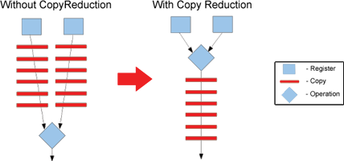
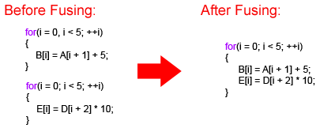
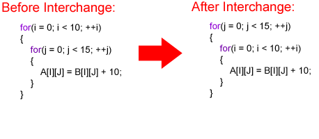

# ROCCC Optimisations

## Code optimisations

### MaximizePrecision

Bitwidth is increased during calculation and truncation happens only as assignation

### TemporalCommonSubExpressionElimination

Data that are calculed several time to the same result in iterations are factored

### MultiplyByConstElimination

Replace multiplications by additions and shifts

### DivisionByConstElimination

Replace divisions by additions and shifts

### ArithmeticBalancing

Arithmetic expression are parallelised to optimise execution time

### CopyReduction

In pipelining, instead of copying values from stages to stages, they are recalculated when needed.

## Loop optimisations

### LoopFusion

Loops with same boundaries and no dependencies are merged into one loop

### LoopInterchange

Switch loop variables of two nested loops

### LoopUnrolling

Unroll loops until the given bound

### InlineModule

Inline a given module at the given place

### InlineAllModules

Inline recursively all modules used

## Low level optimisation

### FanoutTreeGeneration

When pipelining, control the amount of parallelised operation vs the depth of the pipelining

### OperationsPerPipelineStage

When pipelining, control the maximum of operations per pipeline stage

### MaxFanoutRegistered

Control the fanout of unregistered values before using a register, i.e. control the average size of a pipeline step

## Not supported or irrelevant optimisations

### FullyUnroll

Force loop unrolling, automatically applied when module is detected

### Redundancy

Enable double or triple redundancy of a module. Not supported by POROTO

### SystolicArrayGeneration

Perform data iteration as a diagonal wavefront. Not supported by POROTO
